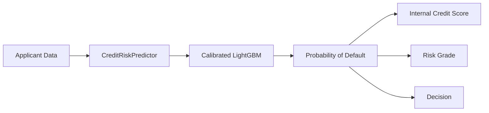
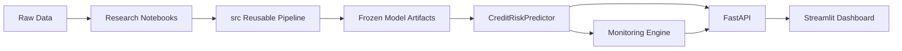

# Credit Risk Scoring & Loan Decision System

This is a portfolio implementation of an end-to-end credit default risk workflow. It estimates applicant Probability of Default (PD), converts calibrated PD into an internal credit score, assigns a risk grade, applies a frozen decision policy, serves predictions through FastAPI, displays results in Streamlit, and simulates model monitoring through batch drift detection.

The project is designed to be readable as both a Data Science project and an ML Engineering project: notebooks document the research path, while `src/`, `api/`, `dashboard/`, `models/`, and `tests/` provide the reproducible implementation.

## 1. Business Problem

The core task is application credit risk assessment:

```text
PD = P(Default = 1 | applicant information)
```

The model output is not just a 0/1 classification. The primary output is calibrated PD, which supports risk ranking, score mapping, risk grading, decision policy, and portfolio monitoring.

This project covers credit default risk for loan applicants. It does not cover fraud detection, AML, mule detection, collections, early warning systems, or 30/60/90-day behavioral delinquency prediction.

## 2. System Overview

Plain flow:

```text
Applicant Data
-> CreditRiskPredictor
-> Calibrated LightGBM
-> Probability of Default
-> Internal Credit Score / Risk Grade / Decision
```



Decision classes:

- `APPROVE`
- `MANUAL_REVIEW`
- `REJECT`

## 3. Architecture

Plain flow:

```text
Raw Data
-> Research Notebooks
-> src Reusable Pipeline
-> Frozen Model Artifacts
-> CreditRiskPredictor
-> FastAPI
-> Streamlit Dashboard

CreditRiskPredictor
-> Monitoring Engine
-> FastAPI
-> Streamlit Dashboard
```



Layer responsibilities:

- `notebooks/`: research, audit, EDA, feature analysis, model analysis.
- `src/`: reusable data, feature, model, decision, inference, and monitoring logic.
- `models/`: frozen artifacts used by inference.
- `api/`: FastAPI service layer.
- `dashboard/`: Streamlit presentation layer that communicates with FastAPI over HTTP.
- `tests/`: automated checks for data validation, features, model artifacts, inference, API, dashboard helpers, and monitoring.

More detail: [Architecture](docs/architecture.md).

## 4. Dataset

Verified from the current frozen metadata and data audit:

| Item | Value |
| --- | ---: |
| Rows | 32,581 |
| Columns | 29 |
| Target | `loan_status` |
| Default observations | 7,108 |
| Default rate | 21.82% |
| Development rows | 26,064 |
| Locked Test rows | 6,517 |

Data quality highlights:

- `person_emp_length`: 895 missing values, 2.75%.
- `loan_int_rate`: 3,116 missing values, 9.56%; excluded from the Primary Model as a leakage-risk feature.
- `person_age`: 5 values outside the configured business range `[20, 100]`.
- `person_emp_length`: 2 values violate the employment-length-vs-age rule.
- No duplicate rows and no duplicate `client_ID` values were found.

## 5. Feature Governance

The frozen Primary Model uses 18 application-time features:

`person_age`, `person_income`, `person_home_ownership`, `person_emp_length`, `loan_intent`, `loan_amnt`, `cb_person_default_on_file`, `cb_person_cred_hist_length`, `marital_status`, `education_level`, `employment_type`, `loan_term_months`, `loan_to_income_ratio`, `other_debt`, `debt_to_income_ratio`, `open_accounts`, `credit_utilization_ratio`, `past_delinquencies`.

Feature groups:

| Group | Current treatment |
| --- | --- |
| Primary features | Used by the final frozen model. |
| Extended-only features | `loan_grade`, `loan_int_rate`; used only for leakage ablation/research, not final inference. |
| Audit-only features | `gender`, `country`, `state`, `city`, `city_latitude`, `city_longitude`; reserved for fairness/proxy review, not model input. |
| Redundant excluded features | `loan_percent_income`, `loan_to_income_ratio_fe`, `total_debt_to_income_ratio`. |
| Never model input | `client_ID`, `loan_status`. |

Key governance principle: predictive signal does not automatically imply modeling eligibility.

## 6. Leakage Controls

Leakage control is built into both research and engineering:

- Primary vs Extended feature sets separate application-time features from leakage-risk candidates.
- `loan_status` and `client_ID` are excluded from model input.
- `loan_grade` and `loan_int_rate` are excluded from the Primary Model.
- Audit/proxy variables are excluded from model input and rejected by the API contract.
- Preprocessing and imputation live inside sklearn pipelines, so fitted statistics are learned inside the training flow.
- The 20% Locked Test split is held out from model selection and tuning.
- Inference rejects forbidden fields such as target, ID, leakage-risk variables, and audit-only variables.

More detail: [Methodology](docs/methodology.md).

## 7. Modeling

The research workflow covers data audit, EDA, leakage audit, feature-set design, preprocessing, baseline models, LightGBM, CatBoost, tuning, calibration, champion selection, score/grade/decision policy, and locked-test evaluation.

Frozen champion:

| Item | Value |
| --- | --- |
| Champion | LightGBM |
| Calibration | Isotonic Regression |
| Raw primary features | 18 |
| Engineered features | 13 |
| Random state | 42 |
| Development CV reference | 5-fold stratified CV |

Selected LightGBM parameters:

```yaml
colsample_bytree: 0.85
learning_rate: 0.05
max_depth: -1
min_child_samples: 40
n_estimators: 150
num_leaves: 31
subsample: 0.85
```

## 8. Evaluation

Evaluation uses an 80% Development / 20% Locked Test split with stratification.

Development data is used for research, cross-validation, tuning, calibration selection, and policy design. Locked Test is reserved for final evaluation of the frozen system.

Frozen Locked Test metrics:

| Metric | Locked Test |
| --- | ---: |
| ROC-AUC | 0.8969 |
| PR-AUC | 0.8062 |
| KS | 0.6427 |
| Gini | 0.7937 |
| Brier Score | 0.0836 |

## 9. Credit Decision Pipeline

The frozen inference path is:

```text
Applicant fields
-> business-rule cleaning
-> feature engineering
-> preprocessing
-> calibrated PD
-> internal score
-> risk grade
-> decision
```

Credit score:

- Range: 300 to 850.
- Higher score means lower modeled PD.
- This is an internal project score, not FICO or an official bureau score.

Risk grades:

| Grade | Meaning |
| --- | --- |
| A | Lowest modeled risk |
| B | Lower modeled risk |
| C | Medium modeled risk |
| D | Higher modeled risk |
| E | Highest modeled risk |

Frozen grade PD boundaries:

`0.011013`, `0.040195`, `0.107527`, `0.364103`

Frozen decision policy:

| Rule | Decision |
| --- | --- |
| `PD < 0.20789473684210527` | `APPROVE` |
| `0.20789473684210527 <= PD < 0.71875` | `MANUAL_REVIEW` |
| `PD >= 0.71875` | `REJECT` |

These thresholds are a simulated project policy, not a real bank lending policy.

## 10. Application Architecture

```text
User
-> Streamlit Dashboard
-> FastAPI
-> CreditRiskPredictor
-> Frozen artifacts
-> PD / score / grade / decision
```

Implemented API endpoints:

- `GET /health`
- `GET /model/info`
- `POST /predict`
- `POST /predict/batch`
- `GET /monitoring/reference`
- `POST /monitoring/analyze`

No `/explain` endpoint is implemented. Risk-driver explanations currently return `risk_drivers = None` and `explanation_status = "explanation_unavailable"`.

More detail: [API Usage](docs/api_usage.md).

## 11. Monitoring

Monitoring is a simulated batch monitoring layer, not live production monitoring.

Reference population:

- Frozen Development population from the 80/20 split.
- Locked Test is not used as the monitoring reference.

Current monitoring includes:

- Feature PSI.
- Missingness drift.
- PD drift.
- Internal credit score drift.
- Risk grade drift.
- Decision drift.

If realized `loan_status` labels are available in a current batch, monitoring also reports ROC-AUC, PR-AUC, KS, Gini, Brier Score, observed default rate, mean predicted PD, and calibration gap.

More detail: [Monitoring](docs/monitoring.md).

## 12. Repository Structure

```text
CREDIT_RISK_PROJECT/
|-- api/
|-- configs/
|-- dashboard/
|-- data/
|-- docs/
|-- models/
|-- notebooks/
|-- reports/
|-- src/
|   |-- data/
|   |-- decision/
|   |-- features/
|   |-- inference/
|   |-- models/
|   `-- monitoring/
|-- tests/
|-- MODEL_CARD.md
|-- README.md
|-- requirements.txt
`-- pytest.ini
```

## 13. Quick Start

From the project root:

```bash
pip install -r requirements.txt
```

Run tests:

```bash
python -m compileall src api dashboard tests
python -m pytest -q
```

Start the API:

```bash
python -m uvicorn api.main:app --reload
```

Start the dashboard in another terminal:

```bash
python -m streamlit run dashboard/app.py
```

Run with Docker Compose:

```bash
docker compose up --build
```

Then open:

- FastAPI docs: `http://localhost:8000/docs`
- Dashboard: `http://localhost:8501`

Shutdown:

```bash
docker compose down
```

Build the monitoring reference and analyze a batch:

```bash
python -m src.monitoring.monitor build-reference
python -m src.monitoring.monitor analyze --input reports/monitoring/synthetic_current_batch_smoke.csv
```

Regenerate frozen model artifacts only when intentionally refreshing artifacts:

```bash
python -m src.models.train
```

The repository already contains frozen artifacts under `models/`; training is not required for normal inference, API, dashboard, or monitoring use.

## 14. Testing

Current verification:

- `python -m compileall src api dashboard tests`: passing.
- `python -m pytest -q`: 154 tests passing.
- `python -m pytest -m integration -q`: 4 integration tests passing.

Coverage includes validation, feature engineering, preprocessing, evaluation helpers, scoring, policy, artifacts, inference, FastAPI, dashboard helpers, and monitoring.

## 15. Limitations

- This is a portfolio project, not a production-approved bank model.
- The dataset has no true live production timeline.
- Monitoring is simulated batch monitoring against a Development reference population.
- Decision thresholds are project policy assumptions.
- The internal credit score is not FICO or an official bureau score.
- Risk-driver explainability is not production-safe yet.
- Audit-only fairness/proxy review does not establish absence or presence of discrimination.
- Drift does not prove model degradation or causal deterioration.
- Predictions are decision-support outputs, not real-world lending authority.

## 16. Future Work

- Production-safe SHAP/risk-driver mapping from encoded features back to raw business concepts.
- Richer fairness and proxy-risk monitoring.
- Real temporal validation if timestamped production data becomes available.
- Authentication, authorization, audit logging, and database persistence.
- CI/CD, container deployment, and model registry integration.

## 17. Detailed Documentation

- [Model Card](MODEL_CARD.md)
- [Architecture](docs/architecture.md)
- [Methodology](docs/methodology.md)
- [API Usage](docs/api_usage.md)
- [Monitoring](docs/monitoring.md)
- [Docker](docs/docker.md)
