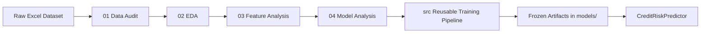
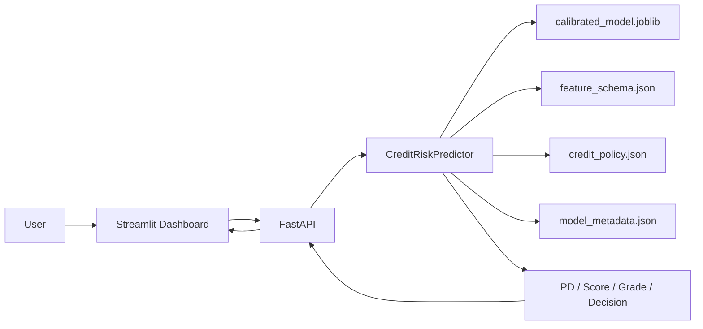
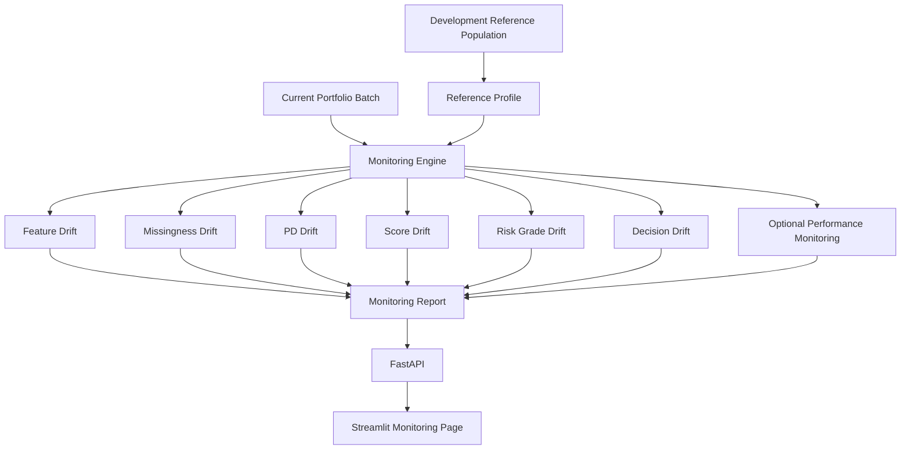

# Architecture

This project separates research, reusable ML logic, model artifacts, service APIs, dashboard presentation, and monitoring. The goal is a readable portfolio implementation rather than a real production bank platform.

## Research to Engineering Flow

Responsibilities:

| Layer | Responsibility |
| --- | --- |
| `notebooks/` | Research narrative, audits, modeling experiments, calibration, policy design, locked-test evaluation. |
| `src/data/` | Data validation and reusable preprocessing components. |
| `src/features/` | Feature eligibility rules and engineered feature builders. |
| `src/models/` | Training, calibration, evaluation, and score mapping helpers. |
| `src/decision/` | Frozen risk-grade and decision policy utilities. |
| `src/inference/` | Artifact loading, schema validation, and prediction orchestration. |
| `src/monitoring/` | Drift and monitoring report logic. |
| `models/` | Frozen model, schema, policy, and metadata artifacts. |

## Serving Architecture

Serving boundaries:

- Streamlit is presentation only and calls FastAPI over HTTP.
- FastAPI validates request structure and delegates scoring to `CreditRiskPredictor`.
- `CreditRiskPredictor` loads frozen artifacts once and enforces the frozen feature contract.
- Decision policy is imported from `src/decision/`; thresholds are not duplicated in the API or dashboard.
- Explainability is explicitly unavailable in the serving layer: `risk_drivers = None`.

## Monitoring Architecture

Monitoring boundaries:

- `src/monitoring/drift.py` contains PSI, bucket, missingness, and status calculations.
- `src/monitoring/monitor.py` builds the reference profile, scores current batches through `CreditRiskPredictor`, and produces monitoring reports.
- FastAPI exposes monitoring endpoints but does not calculate PSI directly.
- Dashboard displays monitoring reports and does not import `src.monitoring`.

## Artifact Contract

The frozen inference contract is stored in `models/`:

| Artifact | Purpose |
| --- | --- |
| `champion_model.joblib` | Frozen uncalibrated champion pipeline. |
| `calibrated_model.joblib` | Frozen calibrated model used for prediction. |
| `feature_schema.json` | Raw primary features, engineered features, excluded groups, schema version. |
| `credit_policy.json` | Score config, risk grade thresholds, decision thresholds, policy status. |
| `model_metadata.json` | Data split, model parameters, metrics, artifact metadata. |

The current artifact version is `2026-08-29-frozen-notebook-04`.

## Single Source of Truth

| Concern | Source of truth |
| --- | --- |
| Feature eligibility | `src/features/build_features.py`, `models/feature_schema.json` |
| Preprocessing | `src/data/preprocessing.py` |
| Training and artifact generation | `src/models/train.py` |
| Evaluation metrics | `src/models/evaluate.py` |
| Score mapping | `src/models/scoring.py` |
| Risk grade and decision policy | `src/decision/policy.py`, `models/credit_policy.json` |
| Inference | `src/inference/predictor.py` |
| Monitoring | `src/monitoring/` |
| API schemas and routes | `api/` |
| Dashboard display | `dashboard/` |

## Non-Goals

This architecture does not claim real production readiness. It does not include authentication, authorization, audit logging, a model registry, database persistence, CI/CD, or real-time streaming monitoring.
