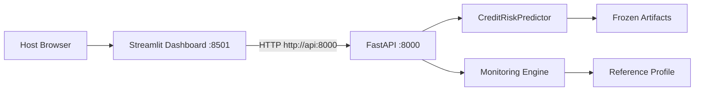

# Docker

Docker support is intended for portfolio reproducibility. Container startup serves the frozen system; it does not train, tune, recalibrate, rebuild artifacts, or rebuild the monitoring reference.

## Architecture



Inside Docker Compose, the dashboard calls:

```text
http://api:8000
```

From the host:

```text
FastAPI:   http://localhost:8000
Dashboard: http://localhost:8501
```

## Files

| File | Purpose |
| --- | --- |
| `docker/Dockerfile.api` | FastAPI runtime image. |
| `docker/Dockerfile.dashboard` | Streamlit runtime image. |
| `docker/requirements-api.txt` | API runtime dependencies. |
| `docker/requirements-dashboard.txt` | Dashboard runtime dependencies. |
| `docker-compose.yml` | Two-service local portfolio stack. |
| `.dockerignore` | Keeps build context focused on runtime files. |

## Runtime Artifacts

The API image includes:

- `api/`
- `src/`
- `configs/`
- `models/`
- `reports/monitoring/reference_profile.json`

The API image does not need notebooks or raw training data to serve predictions.

The dashboard image includes:

- `dashboard/`
- dashboard runtime dependencies

The dashboard image does not include model artifacts and does not load the model directly.

## Run

Build and start:

```bash
docker compose up --build
```

Check services:

```bash
docker compose ps
```

API docs:

```text
http://localhost:8000/docs
```

Dashboard:

```text
http://localhost:8501
```

Shutdown:

```bash
docker compose down
```

## Healthchecks

API healthcheck:

```text
GET http://127.0.0.1:8000/health
```

Dashboard healthcheck:

```text
GET http://127.0.0.1:8501/_stcore/health
```

Both healthchecks use Python standard library HTTP calls, so no extra `curl` package is required.

## Troubleshooting

Docker daemon unavailable:

- Start Docker Desktop and wait until the Linux Engine is running.
- Re-run `docker compose config`, then `docker compose build`.

Port already in use:

- Stop any host process using ports `8000` or `8501`.
- Then rerun `docker compose up --build`.

API cannot load model:

- Confirm `models/calibrated_model.joblib`, `models/feature_schema.json`, `models/credit_policy.json`, and `models/model_metadata.json` exist.
- Rebuild the image after restoring missing artifacts.

Monitoring reference unavailable:

- Confirm `reports/monitoring/reference_profile.json` exists.
- Rebuild the API image after restoring or rebuilding the reference profile.

Dashboard cannot reach API:

- Confirm compose sets `CREDIT_RISK_API_URL=http://api:8000`.
- Do not use `localhost:8000` inside the dashboard container.
